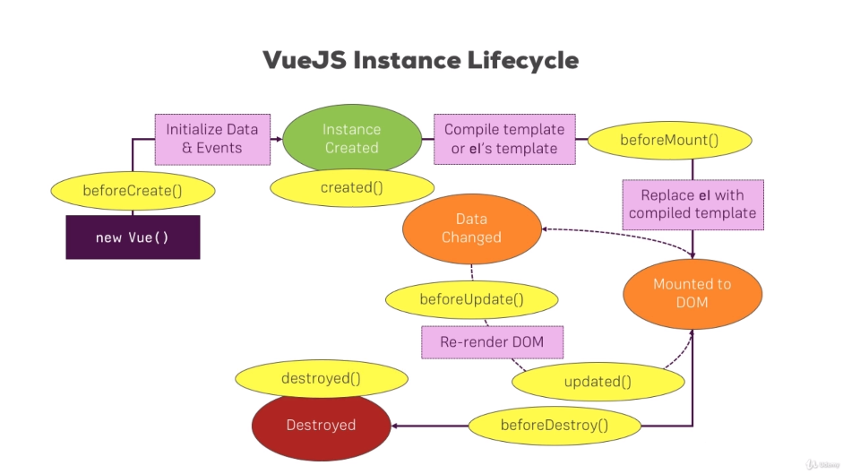

# VueJs 2

## Detalhes e dicas:

- A estrutura é similar a do Polymer. Basta criar uma nova instancia do Vue object e usar as propriedades necessárias.

- Principais props: **el**, **data**, **methods, computed**, **watch.**

- É possível acessar qualquer propriedade de **data** e qualquer método de **methods** usando **this**. O Vue consegue ancorar essas propriedades acessíveis deixando disponíveis ao **this** (ele faz um tipo de proxy).

- Vue renderiza o html do template (aquele que estiver conectado a instância do Vue no html) internamente, faz o processamento e coloca no DOM. Devido a isso ao inspecionar um elemento HTML que o Vue esteja manipulando, não será possível ver referencias dessa “magica” acontecendo.

- Todos os dados em **data** ou **methods** podem ser acessados no HTML utilizando **string interpolation** e sem a necessidade do **this**.

- Não é possível utilizar **string interpolation** diretamente em NENHUM atributo html nativo. O parse não será feito. Para fazer isso é necessário utilizar a diretiva **v-bind:arg**, por exemplo: ``

- Toda propriedade é re-renderizada quando o valor da propriedade é alterado. Para desabilitar esse comportamento basta usar a diretiva **v-once**. Dessa forma o elemento que tiver essa diretiva não terá a propriedade no **string interpolation** alterada com mudanças futuras de valor, se mantendo com o primeiro valor atribuído a ela.

- **Vue sempre processa textos em propriedades como textos** em seu comportamento default. Dito isso, se houver um propriedade em **data** que represente um template html por exemplo, será necessário usar a diretiva **v-html=”prop”** para que ele seja capaz de fazer o sanitaze desse HTML e renderiza-ló como de fato um HTML (e não texto). Vale ressaltar que isso deve ser utilizado com cuidado e apenas se vc conhecer o conteúdo do template e que ele não sofrerá mudanças feitas pelo usuário por exemplo.

- Para lidar com eventos bastas usar a diretiva **v-on:arg** passando em **arg** qualquer propriedade de evento que a tag em questão possua.

- Vue possui **modificadores** de eventos que permitem modificar algum evento. Para usar basta fazer **v-on:arg.modifier** (por exemplo v-on:mousemove.stop). É possível também encadear modificadores como por exemplo **v-on:keyup.enter.space** (nesse caso eventos que escutam quando as teclas enter ou space são pressionadas. 
  - Link para os [modificadores de evento](http://vuejs.org/v2/guide/events.html#Event-Modifiers)
  - Link para os [modificadores de key events](https://vuejs.org/v2/guide/events.html#Key-Modifiers)

- Dentro de qualquer lugar acessível a instancia do Vue é possível escrever javascript puro (desde que não sejam coisas como if, for, etc..). Ex: `<button v-on:click="counter++">Click me</button>`

- Entendendo o ponto acima, podemos então usar inclusive operação ternaria nos **string interpolation**

- Two-way data binding é possível através da diretiva **v-model**

- Para diminuir a dificuldade de manter uma prop atualizada com o mesmo valor em vários lugares diferentes da aplicação, nós podemos fazer uso da propriedade **computed**.

- Tudo que é guardado na nossa propriedade **computed** pode ser usado (e funciona igual) como uma propriedade de **data**. **Computed** é a melhor escolha quando precisamos guardar o resultado (cachear o valor).

- A propriedade **watch** funciona de uma maneira inversa da maioria. No objeto dela as propriedades **devem** **ser** as propriedades (qualquer propriedade, não apenas as que estão em **data**) que nós queremos **escutar as mudanças.** É sempre recomendando usar **computed** por ser mais otimizado e só usar **watch** em ultimo caso.

- Existem shorthands para as direticas, como **v-on:click** = **@click** ou **v-bind:href** = **:href.**

- Para condicionais temos as diretivas **v-if=”var”,** **v-else e v-else-if** que funcionam parecido com angularJs. O else/else-if deve vir na sequencia da tag com o if e será mostrado caso não caia na condição do if.
  - **v-else** só funciona se:
    - Estiver exatamente em baixo do elemento com **v-if** e for do mesmo tipo de tag (se a tag que tem v-if for uma section a tag com v-else **também precisa ser** section).

- Também podemos fazer a mesma coisa do if/else usando **v-show**. É recomendado sempre irmos pelo caminho do if/else pois os mesmos são mais performáticos. Usar o show apenas em ocasiões necessárias.

- Para tratar listas no HTML podemos usar **v-for**=”ingrediente in ingredients” (exemplo). Para pegarmos o valor basta usarmos em conjunto **string interpolation** dentro da tag. É possível alcançar qualquer valor do objeto ingrediente (se ele tiver subníveis).
  - Para termos index: =”(value, index) in ingredientes”
  - É possível fazer **v-for** encadeados. No encadeados podemos ter acesso a (value, key, index).
  - É possível iterar sobe números passados para o **v-for:** v-for=”n in 10”
  - Recomendado usar **:key=”ingridient”** no v-for para que o Vue por baixo dos panos não só guarde a posição do elemento mas o elemento em si (sem o key ele não faz isso por default). Isso faz diferença se em algum momento precisarmos reordenar a lista por exemplo. Ele não vai apenas mudar as posições na memoria e vai também carregar os itens junto, além das posições.
- Vue CLI nos permite criar projetos com bundles prontos (como webpack por exemplo) para projetos de larga escala. Ele nos permite escolher alguns templates nessa criação
  - **Simple:** index.html + Vue CDN import
  - **Webpack-simple:** Basic Webpack Workflow
  - **webpack:** Complex Webpack Workflow (inc. Testing)
  - **browserify / browserify-simple:** Browserify Workflow 

## Vue Instance
### Vue Lifecycle

  

complete Lifecycle from VueJs Docs

  

Another example of VueJs lifecycle

### Funcionamento
- Podemos ter mais de uma instancia do Vue pegando porções de código diferente
  - As propriedades, metódos e etc de uma estancia são acessíveis a intancia em que eles pertencem, e **não é recomendado** acessar de outras intancias. As propriedades devem estar na mesma intancia e atreladas a mesma **regra de negócios**
  - Para acessar basta atribuir as instancias em variáveis e por meio das variaveis será possivel acessar todos os métodos e datas de ambas (Vue faz o mesmo sistema de proxy aqui, não precisando do this). Por exemplo: vm1.title = this.title (equivale a propriedade dentro de data da instancia 1)
- Se atribuirmos a instancia em uma variável e dar um console nela poderemos ver várias propriedades da instancia que podem ajudar a enxergar tudo que a compõe.
- VueJS não impede a integração com JavaScript puro. Como vimos sua instancia pode ser acessada por fora além de que se quisermos por exemplo fazer o objeto de data em uma variável antes da instancia e passar pra ela, funcionara.
- Na instancia temos a propriedade **$refs** que guarda todas as referencias de tags que encontrar dentro dela. Para usar a referencia basta escrever em alguma tag "**ref=nomeDaRefQueVcQuiser**" (ref é uma tag conhecida por Vue, não sendo algo do HTML em si nesse caso). Esse nome estara disponível dentro de **$refs**. As tags guardadas são elementos HTML nativos. Isso pode ser útil se precisarmos acessar algo do elemento nativo ou algo muito especifico
- Vale lembrar que usar **refs** ou mexer com a instancia fora do template do Vue **não é reativo** então deve ser evitado e usado apenas se realmente houver necessidade.
- Podemos usar dentro da instancia a propriedade **template** e passarmos o código html referente a esse template. Isso é similar ao uso do **el** a diferença é que o template já fica definido ali. Podemos combinar isso com o **instancia.$mount('#elemento')**. Usar **template** ou **$mount()** não é comum e o Vue ofereça opções melhores pra isso (como componentes e o proprio **el**).
- VueJs tem duas versões que permitem criar componentes de forma diferente. Nó podemos criar templates no "Vue puro" fazendo algo como
- VueJS usa Virtual DOM para checar se há diferenças fazer as mudanças em cima dos watchers de cada property que temos. Isso faz com que o VueJs seja rápido, pois ele não acessa diretamente o DOM a todo momento. Ele sempre usa a copia do Virtual DOM, que sempre é atualizada quando algo muda para depois mandar a mudança para o DOM verdadeiro.

